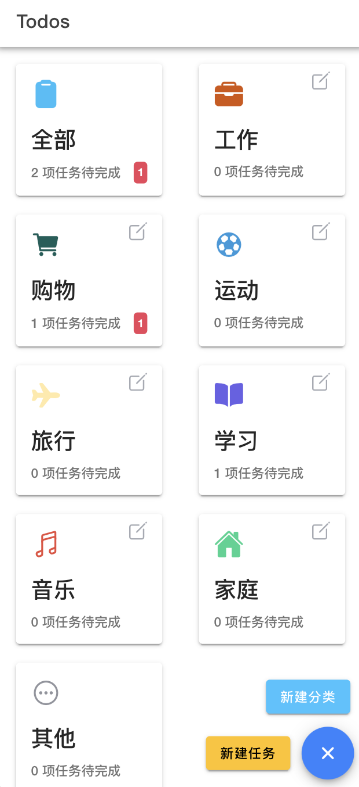
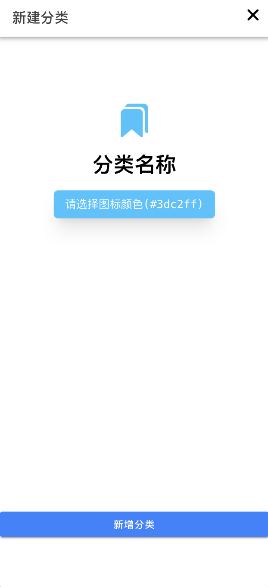
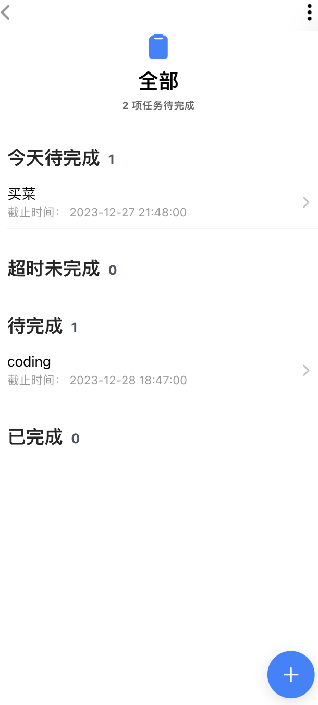

# vue-todos

这是一个移动端的 Todo List 应用，主要实现了新增分类、编辑分类、删除分类、新增任务、编辑任务、删除任务、切换完成状态等功能。

## Project Setup

```sh
pnpm install
```

### Compile and Hot-Reload for Development

```sh
ionic serve
```

```sh
pnpm run dev
```

### Compile and Minify for Production

```sh
pnpm run build
```

## 效果展示









